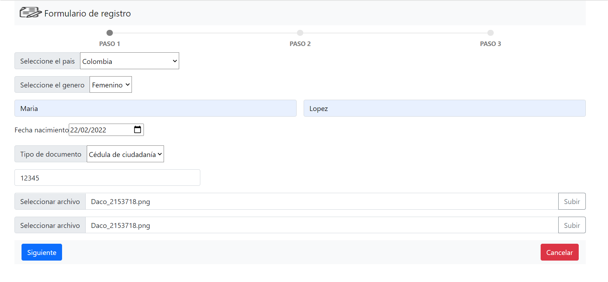
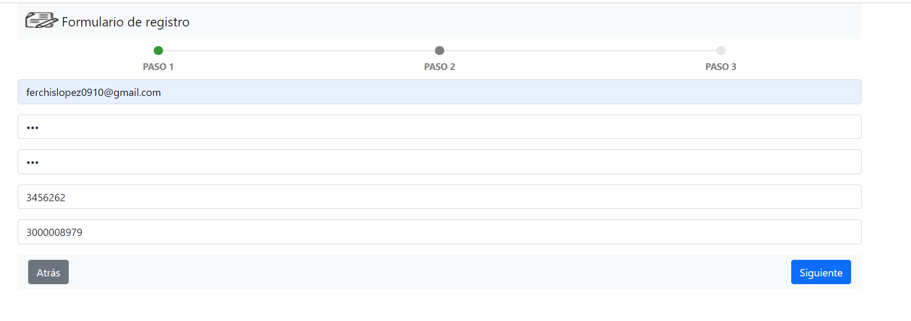
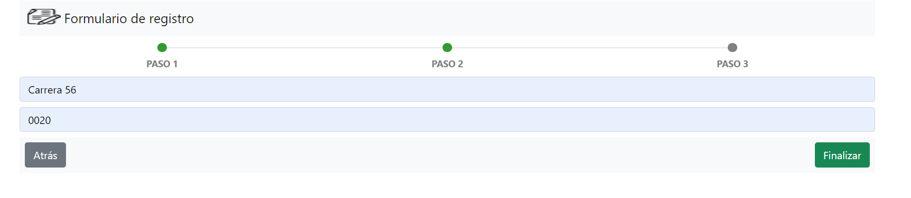
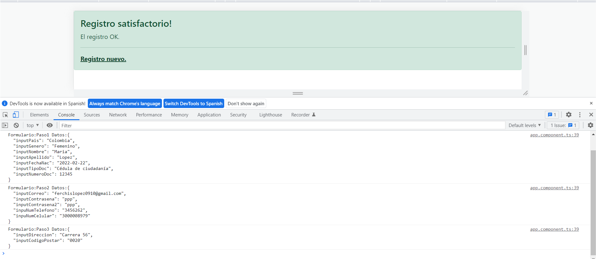

# Formulario de registro con los framework Angular y Bootstrap

## Tecnologias - librerias - Framework: 
- Angular 13
- Bootstrap 5
- angular-archwizard

## Requerimiento: 
- Formulario de registro, guiado por un paso a paso.
- Validación de cada formulario y no deja continuar en caso
	que no tenga todos los campos llenos..
- Integración API Rest para listar los paises en campo tipo select.

## Aprendizaje
- Estructura del programa separada por components
- Integraciones con API Rest con Angular-Services
- Diseño de formulario con Bootstrap
- Diseño de paso con librerias de terceros

## Resultados
- Paso 1

- Paso 2

- Paso 3

- Fin

*:sparkles: Follow me *[Twitter](https://twitter.com/ferchislopez910)*
*

